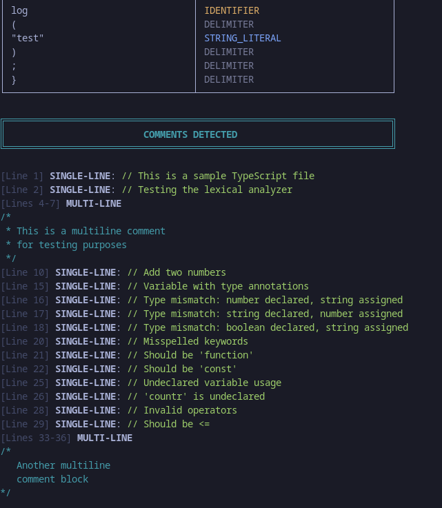
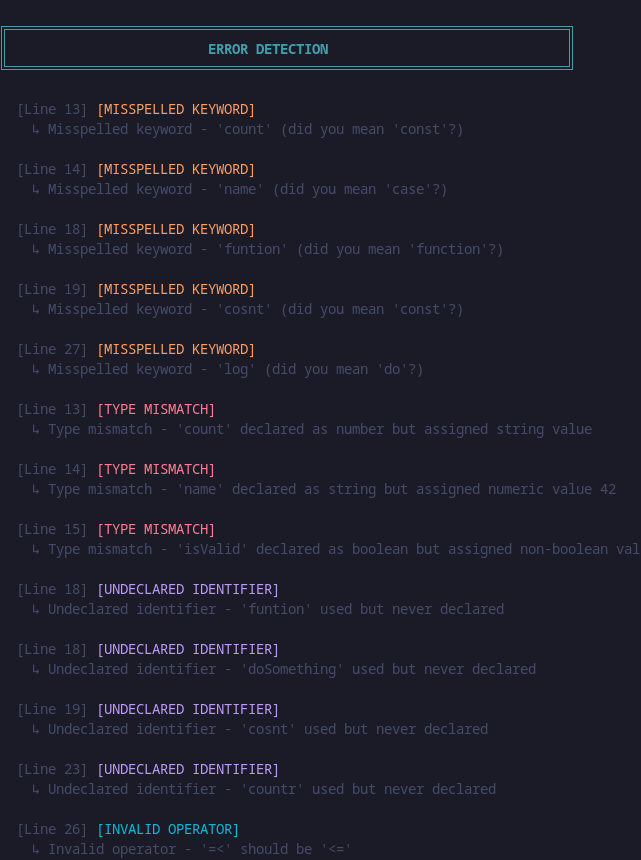

# Lexical Analyzer for Python and TypeScript

A comprehensive lexical analyzer implemented in C that processes Python and TypeScript source code files, performing comment extraction, tokenization, and error detection.

## 📋 Overview

This project implements a complete lexical analyzer (lexer) as part of a compiler design course. The system analyzes source code files, extracts comments, tokenizes code into meaningful units, and detects four categories of common programming errors.

## ✨ Features

- **Multi-Language Support**: Automatically detects and processes Python (`.py`) and TypeScript (`.ts`, `.js`) files
- **Comment Extraction**: Extracts both single-line and multi-line comments with accurate line number tracking
- **Tokenization**: Breaks source code into tokens (keywords, identifiers, literals, operators, delimiters) with proper classification
- **Error Detection**: Detects four types of errors:
  - **Misspelled Keywords**: Uses Levenshtein distance algorithm to suggest corrections
  - **Type Mismatches**: Identifies type annotation/declaration mismatches
  - **Undeclared Identifiers**: Detects variables used without declaration
  - **Invalid Operators**: Flags malformed or language-inappropriate operators
- **User-Friendly Output**: Color-coded terminal interface with structured formatting

## 🖼️ Screenshots

### Tokenization Output

*Example output showing tokenization table with color-coded token attributes*

### Comment Extraction

*Display of extracted single-line and multi-line comments with line numbers*

### Error Detection

*Error detection results showing categorized errors with suggestions*

### Python Analysis

*Complete analysis of a Python source file*

### TypeScript Analysis

*Complete analysis of a TypeScript source file*

## 🚀 Getting Started

### Prerequisites

- GCC compiler (or any C compiler)
- Make (optional, for using Makefile)
- Linux/macOS/Windows (with appropriate compiler)

### Installation

1. Clone the repository:
```bash
git clone https://github.com/yourusername/lexical-analyzer.git
cd lexical-analyzer
```

2. Compile the project:
```bash
make
```

Or manually:
```bash
gcc -Wall -Wextra -g -o lexer lexer.c
```

### Usage

Analyze a Python file:
```bash
./lexer test.py
```

Analyze a TypeScript file:
```bash
./lexer test.ts
```

Analyze a JavaScript file:
```bash
./lexer script.js
```

### Quick Test

Run the included test files:
```bash
make run-python      # Test with test.py
make run-typescript  # Test with test.ts
```

## 📁 Project Structure

```
lexical-analyzer/
├── lexer.c              # Main source code (1,054 lines)
├── Makefile              # Build configuration
├── test.py               # Python test file with errors
├── test.ts               # TypeScript test file with errors
├── README.md             # This file
└── screenshots/          # Screenshot directory (add your screenshots here)
```

## 🔧 Technical Details

- **Language**: C
- **Total Lines of Code**: 1,054
- **Keywords Supported**: 
  - Python: 41 keywords
  - TypeScript: 46 keywords
- **Error Types Detected**: 4
- **Time Complexity**: O(n) for typical source files
- **Memory Management**: Centralized allocation with proper cleanup

## 👥 Team Members

- **Md. Walid Ahmed** - Python Comment Extraction & Tokenization
- **Md Hasibul Hasan** - TypeScript Comment Extraction & Tokenization
- **Touhidul Islam Ayon** - Error Detection Types 1 & 2
- **Mst Shaida Sunjid Chaity** - Error Detection Types 3 & 4
- **Esrat Jahan Ema** - Integration, Testing & I/O

## 🧪 Testing

The project includes comprehensive test coverage:
- **Total Test Cases**: 22
- **Test Pass Rate**: 100%
- **Test Categories**:
  - Input Validation (4 tests)
  - Python Features (6 tests)
  - TypeScript Features (6 tests)
  - Edge Cases (4 tests)
  - Integration (2 tests)

## 📊 Error Detection Examples

### Misspelled Keywords
```python
pritn("Hello")  # Detected: suggests 'print'
defn something():  # Detected: suggests 'def'
```

### Type Mismatches
```python
count: int = 3.14  # Detected: int declared, float assigned
name: str = 42     # Detected: str declared, int assigned
```

### Undeclared Identifiers
```python
total = countr + 5  # Detected: 'countr' is undeclared
```

### Invalid Operators
```python
if x =< 10:  # Detected: should be '<='
if y === 5:  # Detected: '===' not valid in Python
```

## 🛠️ Build Options

```bash
make              # Build the lexer
make clean        # Remove compiled files
make run-python   # Build and run on test.py
make run-typescript # Build and run on test.ts
```

## 📝 Features in Detail

### Comment Extraction
- **Python**: Extracts `#` single-line and `'''`/`"""` multi-line comments
- **TypeScript**: Extracts `//` single-line and `/* */` multi-line comments
- Preserves line numbers and comment content

### Tokenization
- Identifies and classifies:
  - Keywords (language-reserved words)
  - Identifiers (variables, functions)
  - Literals (integers, floats, strings)
  - Operators (arithmetic, comparison, logical)
  - Delimiters (parentheses, brackets, commas, etc.)

### Error Detection Algorithms
- **Levenshtein Distance**: For misspelled keyword detection
- **Pattern Matching**: For type mismatch detection
- **Symbol Table**: For undeclared identifier detection
- **Rule-Based Validation**: For invalid operator detection

## 🎯 Use Cases

- Educational tool for learning compiler design
- Code quality checking before compilation
- Understanding lexical analysis principles
- Error detection in early development stages
- Teaching tool for compiler courses

## 📚 Documentation

For detailed documentation, see:
- [Integration Testing Report](INTEGRATION_TESTING_REPORT.md)
- Project Report Chapters (chapter1-5)

## 🤝 Contributing

This is an educational project. Contributions and improvements are welcome! Please feel free to:
- Report bugs
- Suggest new features
- Add support for additional languages
- Improve error detection algorithms

## 📄 License

This project is developed for educational purposes as part of a compiler design course.

## 🙏 Acknowledgments

- Course instructors for guidance on compiler design principles
- Team members for collaborative development
- Open-source community for inspiration and best practices

## 📧 Contact

For questions or suggestions, please open an issue in the repository.

---

**Note**: This project is part of a university compiler design course. It demonstrates fundamental lexical analysis principles through practical implementation.

